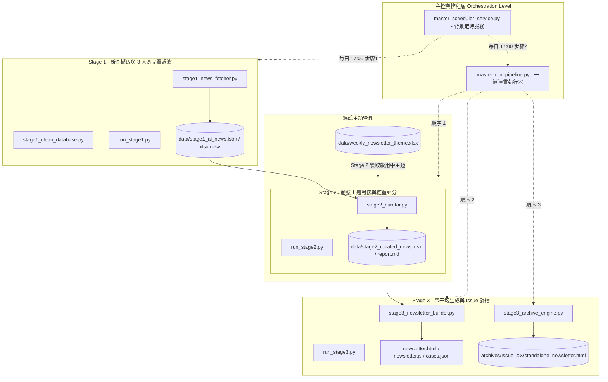

# 📋 AI 趨勢聽誌與電子報自動化生成系統 (Multi-Stage Edition) Implementation Plan

本文件為 **智企前瞻 AI Pulse - AI 趨勢聽誌與電子報自動化生成系統** 之完整技術實作計畫書 (Implementation Plan)。本系統旨在建立一套零捏造數據、高效且具備商業實務價值的自動化聽誌與電子報發行平台。

---

## 📌 1. 專案目標與架構總覽 (Project Goals & Architecture)

### 核心目標
1. **零捏造數據 (Zero Hallucination)**：100% 忠實摘錄與對接真實權威新聞媒體報導，保證高階主管閱讀之權威性。
2. **多階段流水線 (Multi-Stage Pipeline)**：將系統拆解為 Stage 1、Stage 2、Stage 3 三大單向流動處理階段，極大化模組化維護性與獨立測試能力。
3. **動態週主題對接 (Dynamic Theme Alignment)**：透過 Excel 設定檔讓編輯團隊彈性切換週主題，系統自動評比與生成對應領域案例。
4. **離線單檔與自動封存 (Standalone Archiving)**：每次發行自動產生完全離線可讀的 HTML，並按期數歸檔存查。

---

## 🏗️ 2. 多階段流水線設計 (Multi-Stage Pipeline Design)



---

## ⚙️ 3. 各階段組件實作規格 (Component Specifications)

### 🔹 Stage 1：新聞擷取與高品質過濾 (News Fetcher & Quality Filter)
- **檔案**：`stage1_news_fetcher.py` / `stage1_clean_database.py` / `run_stage1.py`
- **輸入**：全網 RSS 源（TechCrunch, Wired, VentureBeat）+ 8 大領域 Google News API (TW/US) 雙區檢索。
- **處理邏輯**：
  1. 執行 3 大高品質過濾原則：
     - **特定應用場景** (排除純融資/估值/活動報名，需含客服/製造/供應鏈/HR/法務等具體場景)。
     - **技術細節** (包含大模型名稱或技術如 RAG, Agentic, Vector DB 等)。
     - **量化效益或處置方案** (包含數據如 %, 縮短, 降低或落地規範指引)。
  2. 進行自動去重與增量寫入。
- **產出**：`data/stage1_ai_news.json` / `stage1_ai_news.xlsx` / `stage1_ai_news.csv`

---

## 🔹 Stage 2：動態主題策展與評分 (Theme Curator & Scoring)
- **檔案**：`stage2_curator.py` / `run_stage2.py`
- **輸入**：`data/stage1_ai_news.json` + `data/weekly_newsletter_theme.xlsx` (自動讀取【啟用中 (Active)】主題)。
- **處理邏輯**：
  1. **4 大評分指標 (100分)**：
     - 主題契合度 (40%)
     - 實務價值與 ROI (30%)
     - 媒體權威度與時效 (20%)
     - 可讀性與切入點 (10%)
  2. 依評分由高至低篩選 Top 20 精選新聞，寫入 5 大專家職能視角（HR、財務、法務、行銷、製造）之選入理由。
- **產出**：`data/stage2_curated_news.xlsx` / `data/stage2_curated_report.md`

---

## 🔹 Stage 3：電子報生成與封存歸檔 (Newsletter Builder & Archive Engine)
- **檔案**：`stage3_newsletter_builder.py` / `stage3_archive_engine.py` / `run_stage3.py`
- **輸入**：`data/stage2_curated_news.xlsx` + `data/weekly_newsletter_theme.xlsx`
- **處理邏輯**：
  1. 100% 動態從 Stage 2 評分最高的前 6 篇新聞提取真實標題、內文摘要、媒體來源與選入理由，建構 6 大結構化案例。
  2. 同步更新 `newsletter.html` (Hero Banner、主題標籤、單集導讀) 與 `newsletter.js` (`EMBEDDED_CASES` 備援數據)。
  3. 自動將 HTML、CSS、JS、精選 Excel 與 JSON 打包複製至 `archives/Issue_XX/` 目錄，並產生單檔離線版 `standalone_newsletter.html`。
- **產出**：`newsletter.html` / `data/newsletter_cases.json` / `archives/Issue_XX/` 歸檔包

---

## 📂 4. 專案目錄結構 (Project Directory Layout)

```text
ai_trend_listening/
├── data/                                 # 資料庫與設定檔目錄
│   ├── weekly_newsletter_theme.xlsx     # ⭐️【編輯核心】每周主題設定檔
│   ├── stage1_ai_news.json              # Stage 1 增量新聞庫 (JSON)
│   ├── stage1_ai_news.xlsx              # Stage 1 原始新聞 (Excel)
│   ├── stage1_ai_news.csv               # Stage 1 原始新聞 (CSV)
│   ├── stage2_curated_news.xlsx         # Stage 2 評比精選新聞 (Excel)
│   ├── stage2_curated_report.md         # Stage 2 專家評比分析報告 (Markdown)
│   └── newsletter_cases.json            # Stage 3 精選 6 大案例庫 (JSON)
│
├── archives/                             # 歷史電子報自動封存目錄
│   └── Issue_XX_YYYY-MM-DD_主題/        # 獨立期數備份 (含離線單檔 HTML)
│
├── run_stage1.py                        # 🚀 Stage 1 獨立執行器
├── run_stage2.py                        # 🎯 Stage 2 獨立執行器
├── run_stage3.py                        # 📰 Stage 3 獨立執行器
│
├── stage1_news_fetcher.py               # Stage 1 新聞爬取與過濾邏輯
├── stage1_clean_database.py             # Stage 1 資料庫清理工具
├── stage2_curator.py                    # Stage 2 主題評比與策展邏輯
├── stage3_newsletter_builder.py         # Stage 3 電子報動態生成邏輯
├── stage3_archive_engine.py             # Stage 3 期數自動歸檔邏輯
├── master_run_pipeline.py               # 🚀 一鍵連貫全流程調度器
├── master_scheduler_service.py          # ⏰ 24小時背景定時維運服務
├── setup_weekly_theme_excel.py          # 週主題 Excel 初始化工具
│
├── newsletter.html                      # 電子報主頁面 (HTML)
├── newsletter.css                       # 純白明亮風格 UI 樣式檔
├── newsletter.js                        # 互動邏輯、動態過濾與雙軌備援
│
├── IMPLEMENTATION_PLAN.md               # 📋 本技術實作計畫書
├── USER_MANUAL_AND_ARCHITECTURE_GUIDE.pdf # 📕 完整 PDF 手冊與架構指南
```
