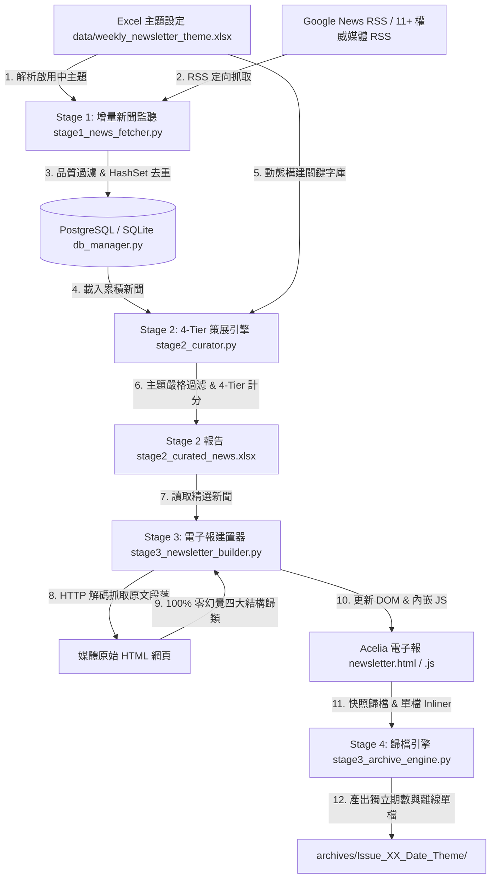

# AI Trend Listening 5.0
## 商業 AI 趨勢即時監聽與自動化電子報發行系統 — 產品需求與技術深度規格書 (PRD v5.0 完整版)

| 項目 | 內容規格 |
| :--- | :--- |
| **文件版本 (Version)** | `v5.0 (2026-08 最新 PostgreSQL 向量資料庫升級與 4-Stage 流水線完整規格版)` |
| **專案負責人 (Owner)** | Pei-Ying (AI Trend Listening 團隊) |
| **系統品牌 (Brand Name)** | **AI Trend Listening** (原 智企前瞻 AI Pulse) |
| **系統架構 (Architecture)** | 4-Stage Multistage Pipeline & Enterprise PostgreSQL (pgvector) & Master Scheduler Service |
| **排程發行機制 (Schedule)** | Stage 1 每日 17:00 增量監聽 / Master Pipeline 每週五 09:00 電子報生成與歸檔 |
| **數據與主題策展原則** | 100% 主題對接熔斷 (Strict Theme Relevance Gate) + 增量數據保護 (HashSet 去重與永續寫入) |
| **內容筆記規範 (Digest Standard)** | HTTP 網頁全文解碼 + 100% 忠實原文四大結構歸類 (零幻覺) + 贅字過濾 |
| **電子報視覺風格 (UX Style)** | Acelia 雜誌/SaaS 質感風格 (雙邊對齊 Justified Text + HSL 膠囊標籤 + Modal Drawer) |

---

## 一、 專案背景與產品願景 (Background & Vision)

### 1.1 產業背景與市場痛點
隨著生成式 AI (Generative AI) 與 Agentic AI (代理式 AI) 的爆發性成長，企業高階決策者、營運主管與廣大職場員工面臨嚴重的「資訊過載」與「真假資訊混雜」問題。市面上多數 AI 科技新聞充斥著純融資炒作、股價波動、公關宣傳或活動報名廣告，缺乏能真正指導企業轉型、具備量化效益 (Operational ROI) 與技術細節的落地實務內容。

### 1.2 產品定位與核心願景
《AI Trend Listening》（原 智企前瞻 AI Pulse）旨在打造一套全自動、高可靠性的商業 AI 趨勢監聽與電子報發行系統。透過『增量新聞監聽 ➔ 4-Tier 智慧主題策展 ➔ Acelia 雜誌/SaaS 質感電子報建置 ➔ 自動化期數歸檔』全流程 Pipeline，每日 17:00 自動為企業同仁與高階主管提供最具商業價值與職場落地指引的趨勢情報。

---

## 二、 目標使用者與關鍵痛點 (Target Persona & Key Pain Points Solved)

### 2.1 目標使用者畫像 (Target Persona)
1. **企業職場同仁與工程師 (Enterprise Employees & Engineers)**：
   - 需求：希望了解最新 AI 工具在日常工作流、智慧製造、供應鏈運籌與專案協作中的實務落地應用。
   - 偏好：注重具體技術細節、軟硬體規格與可執行的操作指引。
2. **高階決策者與部門主管 (Executives & Operations Managers)**：
   - 需求：需要權威媒體來源、量化財務與營運數據（如 %、成、倍、億元、ROI），作為年度數位轉型與算力佈局決策依據。
   - 偏好：注重專家評比切入點、戰略佈局與風險控管指引。

### 2.2 核心痛點與系統性解法矩陣

| 核心痛點 | 傳統新聞/報表缺點 | AI Trend Listening v5.0 系統性解法 |
| :--- | :--- | :--- |
| **痛點 1 — 資訊噪音與主題脫節** | 報導大量無關醫療資安、股票炒作或論壇報名廣告。 | **Stage 1 3大品質過濾器** + **Stage 2 100% 主題對接熔斷機制 (Score = 0 直接排除)**。 |
| **痛點 2 — 摘要空泛與生成幻覺** | LLM 自行生成摘要容易產生虛構數據或機械式廢話。 | **Stage 3 HTTP 網頁全文解碼與真實段落抓取**，100% 忠於原文內文，杜絕幻覺。 |
| **痛點 3 — 閱讀體驗缺乏結構** | 段落混亂、字句未對齊、缺乏層次感。 | **四大結構化主題標題** + **Acelia SaaS 前端雙邊對齊 (Justified Text)** 專業視覺。 |
| **痛點 4 — 期數歷史資產散失** | 發行後舊內容無法追溯、離線無法閱讀。 | **Stage 4 自動化獨立期數資料夾歸檔** + **單檔內嵌 HTML (`standalone_newsletter.html`)**。 |
| **痛點 5 — 高併發與單檔寫入鎖定** | SQLite 寫入鎖定爭用、資料無法擴充向量搜尋。 | **PostgreSQL + pgvector 向量資料庫升級**，提供無寫入鎖定與高效向量檢索。 |

---

## 三、 系統總體技術架構 (System Architecture Overview)

### 3.1 4-Stage 多階管道 Pipeline 數據流



### 3.2 系統雙排程機制 (`master_scheduler_service.py`)
- **任務 1（每日增量新聞監聽）**：每日 **17:00** 自動執行 `stage1_news_fetcher.py` 進行新聞抓取與增量累積至資料庫。
- **任務 2（每週電子報生成與歸檔）**：每週五 **09:00 AM** 自動調用 `master_run_pipeline.py` 依序執行 Stage 2 ➔ Stage 3 ➔ Stage 4 完成當期電子報建置與獨立期數快照歸檔。

### 3.3 PostgreSQL + pgvector 資料庫架構 (`db_manager.py`)
系統全面升級為 PostgreSQL 生態系，提升寫入效能並導入向量擴充套件：
- **核心資料表 (Tables)**：
  - `articles`：記錄 Stage 1 抓取與過濾後的新聞（包含 `title`, `link`, `content`, `trend_tags`, `published_date`, `vector(1536)` 向量欄位）。
  - `weekly_themes`：記錄每週發行的主題設定與評估原則。
  - `curated_articles`：記錄 Stage 2 策展選入的 Top 精選文章與評分詳細資訊。
- **高併發與 Vector 檢索**：支援 pgvector (`vector(1536)`) 進行語意檢索，且零寫入鎖定爭用 (No Write Lock Contention)。
- **自動向下相容 (SQLite Fallback)**：當 PostgreSQL 連線異常時，系統會自動備援回原本 SQLite/JSON 檔案，確保 Pipeline 運行可靠性。

---

## 四、 Stage 1 深度技術規格：增量新聞監聽與品質過濾器

### 4.1 增量數據保護與 HashSet 去重機制
- **核心檔案**：`stage1_news_fetcher.py` / `db_manager.py`
- **數據保護原則**：**只增不刪 (Zero-Data-Loss Incremental Persistence)**。
- **起始限制日**：`START_DATE = '2026-07-27'`（僅累積此日期以後發布之新聞）。
- **去重邏輯**：
  ```python
  seen_links = set()
  seen_titles = set()
  # 啟動時預先載入既存數據庫
  for art in get_all_articles():
      seen_links.add(art["link"])
      seen_titles.add(art["title"].lower().strip())
  ```

### 4.2 廣泛全領域 AI 監聽語法 (Broad AI Trend Crawling)
Stage 1 保持完全獨立解耦，不綁定當期週主題，專注抓取並累積全領域 AI 趨勢新聞：
- **廣泛通用領域語法**：涵蓋智慧製造、供應鏈、研發科學、企業轉型、資安合規、晶片算力、LLMs 與 Agentic AI 等 8 大領域之通用搜尋語法。
- **主題對接權責解耦**：當期主題之解析（`data/weekly_newsletter_theme.xlsx`）與動態關鍵字擴充完全集中於 **Stage 2 策展大腦** 進行對接與篩選。

### 4.3 多源抓取管道與媒體覆蓋

| 類別 | 來源類型 | 涵蓋媒體與語法 |
| :--- | :--- | :--- |
| **定向搜尋** | Google News RSS (TW & US) | 動態對接當期主題 + 8 大領域通用語法（製造、研發、企業、資安等） |
| **國際頂級科技 RSS** | Direct Feed (English) | TechCrunch AI, Wired AI, VentureBeat AI, Ars Technica AI |
| **台灣權威科技/商業 RSS** | Direct Feed (Traditional Chinese) | iThome 科技報, 科技新報 TechNews, 經理人月刊 |
| **官方巨頭/實驗室 RSS** | Direct Feed | Google Official Blog, NVIDIA Newsroom |

### 4.4 3 大品質過濾演算法 (`is_high_quality_article`)
文章必須**同時滿足**以下篩選條件，否則直接剔除：
1. **負向排除條件 (Negative Filter - `EXCLUDE_TERMS`)**：
   - 排除純粹資金炒作（如：`單純融資`, `估值飆升`, `股票暴漲`, `series a`）。
   - 排除公關活動報名（如：`論壇報名`, `活動報名`, `免費報名`, `研討會報名`, `d forum`, `event go`）。
2. **應用情境條件 (Specific Use Case - `USE_CASE_TERMS`)**：
   - 必須包含具體業務/工業情境（如：`客服`, `供應鏈`, `維護`, `自動化`, `倉儲`, `機房`, `良率`, `電動車`, `電池`, `自駕`）。
3. **技術架構條件 (Technical & Architectural Details - `TECH_TERMS`)**：
   - 必須包含具體 AI/軟硬體技術名稱（如：`llama`, `claude`, `gemini`, `gpt`, `deepseek`, `rag`, `agent`, `fine-tuning`, `copilot`, `transformer`）。
4. **量化效益與指引條件 (Quantifiable Impact & Solutions - `IMPACT_TERMS`)**：
   - 必須包含量化數據或解決方案詞彙（如：`%`, `成`, `倍`, `縮短`, `提升`, `降低`, `ROI`, `處置`, `解決方案`, `步驟`, `指引`, `框架`）。

### 4.5 8 大趨勢領域分類法 (`TREND_TAXONOMY`)
文章抓取後自動進行多標籤分類（`trend_tags`）：
- 智慧製造與工業 AI (`emerald`)
- 供應鏈韌性與物流自動化 (`cyan`)
- 研發與創新 (`blue`)
- Agentic AI / 代理式 AI (`cyan`)
- LLMs & Reasoning / 大語言模型與推理 (`emerald`)
- Sovereign AI & Policy / 主權 AI 與法規 (`amber`)
- Chips & Hardware / 晶片與算力 (`rose`)
- Enterprise & ROI / 企業應用與效益 (`purple`)

---

## 五、 Stage 2 深度技術規格：主題策展與 4-Tier 評分引擎

### 5.1 動態主題管理者與動態搜尋對接引擎 (`get_active_theme_queries` & `DOMAIN_EXPANSION`)
- **核心檔案**：`stage2_curator.py`
- **動態主題解析與 RSS 語法注入**：
  Stage 2 擔任整套系統的「主題大腦 (Theme Controller)」，負責自動解析 `data/weekly_newsletter_theme.xlsx` 當前【啟用中】主題名稱 (`active_theme`) 與重點對應領域 (`focus_domains`）。動態構建並注入 Google News RSS 定向搜尋語法：
  - **完整主題搜尋**：`AI {active_theme} after:2026-07-26`（繁中/英文雙語）
  - **重點領域拆解**：`AI {kw} after:2026-07-25` 與 `{kw} AI after:2026-07-25`
- **語意擴充庫 (`DOMAIN_EXPANSION`)**：將主題與領域關鍵字自動擴充至產業同義詞庫：
  - `自動化` ➔ `automation`, `協同`, `單機控制`, `手臂`, `機器人`, `cobot`, `plc`, `agv`, `amr`
  - `電動車` ➔ `ev`, `autonomous`, `battery`, `tesla`, `特斯拉`, `鴻海`, `智慧駕駛`, `續航`

### 5.2 嚴格主題對接門檻過濾 (100% Relevance Gate)
為了防止無關主題新聞混入電子報，`evaluate_article` 設有**嚴格熔斷門檻**：
- 系統將文章標題與內文對當期主題標題及重點領域關鍵字進行匹配。
- **若文章對當期主題的關鍵字命中次數為 0**，`evaluate_article` 直接回傳 `Score = 0`，100% 熔斷排除（確保非當期主題新聞無條件落選）。

### 5.3 4-Tier 權重計分演算法與算式詳解 (最高 100 分)

```
Total Score = Score_Theme (Tier 1: 70%) + Score_Biz (Tier 2: 10%) + Score_Auth (Tier 3: 10%) + Score_Appeal (Tier 4: 10%)
```

| 計分層級 (Tier) | 權重配比 | 滿分上限 | 計算公式與評估標準 |
| :--- | :--- | :--- | :--- |
| **Tier 1: 主題契合度 (Theme Match)** | **70%** | **70 分** | `min(title_matches * 20 + matched_domains * 15 + matched_kws * 5, 70)`<br>評估文章與當期主題之標題命中、重點領域與關鍵字配對密度。 |
| **Tier 2: 實務價值與 ROI (Business Value)** | **10%** | **10 分** | `min(count(biz_kws) * 2, 10)`<br>檢測包含 `工廠`, `生產力`, `轉型`, `良率`, `成本`, `縮短`, `%`, `美元`, `億` 等實務與數據詞。 |
| **Tier 3: 媒體權威與時效 (Authority)** | **10%** | **10 分** | 命中權威媒體名單（iThome, TechCrunch, Wired, UDN, 天下雜誌, NVIDIA, Google 等）給 **10 分**，其餘給 **5 分**。 |
| **Tier 4: 可讀性與切入點 (Reader Appeal)** | **10%** | **10 分** | 新聞內文摘要長度 > 40 字且語意完整給 **10 分**，否則給 **5 分**。 |

---

## 六、 Stage 3 深度技術規格：Acelia 質感電子報建置器

### 6.1 動態 Top-N 案例載入與零湊數機制
- **核心檔案**：`stage3_newsletter_builder.py`
- **案例選取原則**：從 Stage 2 產出中選取評分最高的前 6 篇文章（Top 6）。
- **零湊數保護**：若符合當期主題的高分新聞不足 6 篇（如 2 篇或 4 篇），系統動態呈現實際篇數，並同步調整 UI 標題為 `精選 {case_count} 大深度實務案例`，絕不填補假案例。

### 6.2 HTTP 網頁全文解碼與段落抓取引擎 (`fetch_full_article_content`)
為杜絕 LLM 摘要產生的文字幻覺，系統採取真實網頁全文抓取：
1. **Google News RSS 轉址解碼**：引進 `googlenewsdecoder` (`new_decoderv1`) 將 `news.google.com` 轉址連結還原為原始新聞媒體真實 URL。
2. **HTTP 內文抓取與雜訊過濾**：使用 `urllib.request` 發起 HTTP 請求，解析 HTML `<p>` 標籤，過濾 Cookie 政策、廣告與社群宣告。

### 6.3 100% 忠於原文零幻覺「四大結構標題」歸類演算法 (`categorize_paragraphs`)
抓取到的真實段落透過關鍵字辨識演算法，自動歸類為四大固定結構標題：

```
📌 一、 核心背景與報導概要 （事件起因與總體摘要）
⚙️ 二、 關鍵技術與產品細節 （包含 AI 模型、晶片、軟硬體架構）
📊 三、 營運數據與市場動態 （包含 財務數字、交車量、良率、營收、毛利）
🚀 四、 戰略佈局與產業展望 （包含 長遠佈局、合作廠房、供應鏈規劃）
```

- **無模板贅字規範**：全面移除 `... 摘錄自《...》全文，提供...` 等機械式模板字眼，確保閱讀筆記乾淨順暢。

### 6.4 當期動態重點速覽提煉機制 (`generate_dynamic_takeaways`)
Hero 區塊的 `📖 本期導讀與重點速覽` 下方三大 Takeaway 卡片，全面摒棄固定靜態文字，改為自動根據 Top 6 案例的真實標題與技術亮點動態提煉：
- **① 核心技術與防護進展**：提煉案例 1-2 的核心技術。
- **② 實體場景與落地應用**：提煉案例 3-4 的邊緣/實體落地應用。
- **③ 產業佈局與效益評估**：提煉案例 5-6 的 ROI 與戰略步驟。

### 6.5 Acelia 雜誌/SaaS 前端視覺規格
- **全版面文字雙邊對齊 (Justified Text Standard)**：前端 CSS (`newsletter.css`) 針對導讀段落 (`.lead-in-card p`)、重點速覽 (`.highlight-item p`)、案例摘要 (`.case-summary`) 及 Modal 筆記 (`#modal-digest-box`) 統一套用 `text-align: justify;`。
- **雙軌互動體驗**：
  - 按鈕 1：`📖 細讀實務案例` ➔ 觸發 Modal Drawer 彈窗，展示 100% 原文四大結構閱讀筆記。
  - 按鈕 2：`🔗 閱讀新聞原文` ➔ 開啟新分頁直達原始報導網頁。

---

## 七、 Stage 4 深度技術規格：期數歸檔與離線單檔生成引擎

### 7.1 動態期數資料夾與快照歸檔機制
- **核心檔案**：`stage3_archive_engine.py`
- **資料夾命名規範**：`archives/Issue_{期數編號}_{日期}_{主題簡稱}/`
  - 範例：`archives/Issue_4_2026-07-29_AI_重塑自動化.../`
- **快照複製檔案清單**：`newsletter.html`, `newsletter.css`, `newsletter.js`, `stage2_curated_news.xlsx`, `stage2_curated_report.md`, `newsletter_cases.json`, 圖片資產 (`case*.png`)

### 7.2 離線單檔 Inliner 演算法 (`standalone_newsletter.html`)
自動將 CSS 內容注入 `<style>` 標籤、將 JS 內容注入 `<script>` 標籤，打包成完全不依賴外部檔案的獨立離線單檔 `standalone_newsletter.html`，利於 Email 附件發送與長期備份。

---

## 八、 系統運作與維運手冊 (Operational & Maintenance Guide)

### 8.1 核心執行指令

```powershell
# 1. 啟動 PostgreSQL Docker 容器 (若使用本地 PostgreSQL)
docker compose up -d

# 2. 一鍵初始化資料庫 Schema 與移轉數據
python init_db_and_migrate.py

# 3. 執行主管道 (Stage 2 ➔ Stage 3 ➔ Stage 4 Archive Engine)
python master_run_pipeline.py

# 4. 手動執行 Stage 1 增量新聞抓取
python run_stage1.py

# 5. 啟動每日 17:00 全自動常駐排程服務
python master_scheduler_service.py
```

### 8.2 常駐排程與錯誤備援機制
- **常駐服務**：`master_scheduler_service.py` 建議部署於伺服器後台常駐。
- **檔案鎖定備援 (File Lock Fallback)**：當 `stage2_curated_news.xlsx` 遭 Microsoft Excel 開啟鎖定時，系統自動啟用 `stage2_curated_news_latest.xlsx` 備援寫入機制，確保 Pipeline 不中斷。
- **資料庫斷線備援 (Database Connection Fallback)**：PostgreSQL 斷開時自動 Fallback 至 SQLite，維護 100% 高可用性。

---

## 九、 PRD 版本演進對照表 (Version Changelog)

| 變更項目 | PRD v4.0 (舊版) | PRD v5.0 (最新版) |
| :--- | :--- | :--- |
| **資料庫架構** | 檔案型 JSON / SQLite 累積數據庫 | **PostgreSQL + pgvector 向量擴充套件** (支援高併發與語意搜尋) |
| **品牌名稱** | AI Trend Listening | **AI Trend Listening** 全面統一 |
| **Stage 1 去重與儲存** | JSON/CSV 寫入去重 | **PostgreSQL/SQLite 雙軌備援 + HashSet (Link+Title) 去重** |
| **Stage 2 篩選邏輯** | 4-Tier 權重計分 + 主題熔斷 | **100% 主題對接熔斷門檻 + 4-Tier 動態權重計分 (最高 100 分)** |
| **Stage 3 摘要來源** | HTTP 全文解碼 + 四大結構標題 | **`googlenewsdecoder` HTTP 全文解碼 + 四大結構化段落歸類** |
| **Stage 4 歸檔機制** | 全自動期數資料夾快照 | **快照資料夾歸檔 + `standalone_newsletter.html` 單檔 Inliner 打包** |
